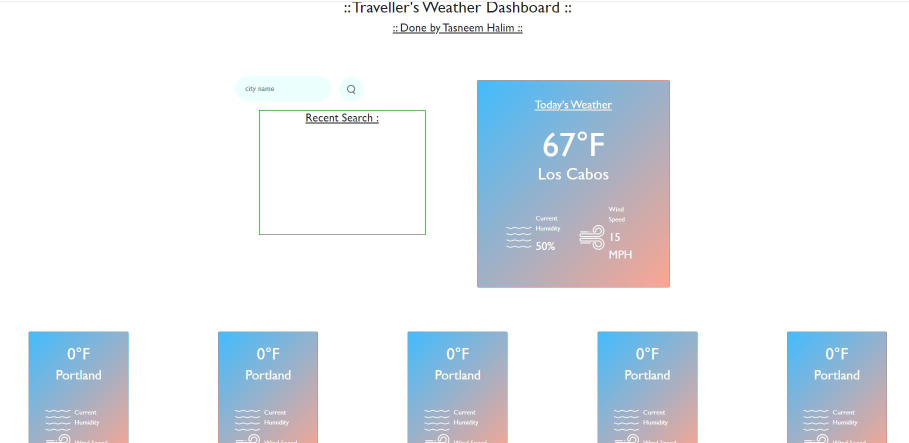
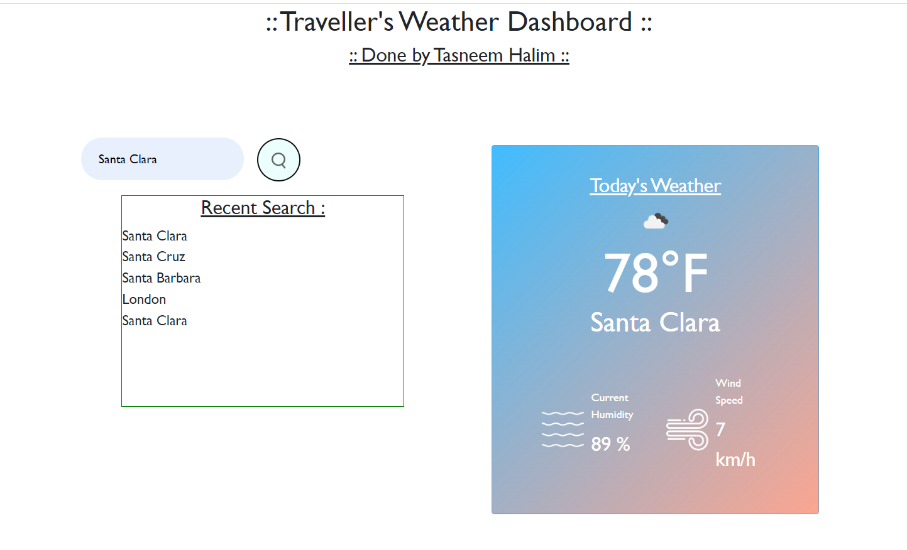
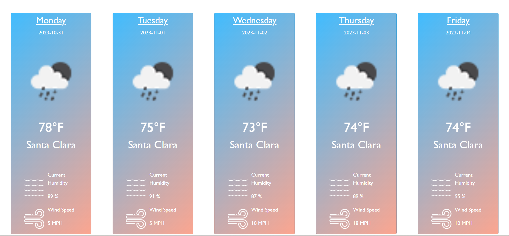

# Myweather_Dashboard

## Description

Third-party APIs allow developers to access their data and functionality by making requests with specific parameters to a URL. 
- The challenge is to build a weather dashboard that will run in the browser and feature dynamically updated HTML and CSS.
- This is the sixth challenge for the bootcamp coding class.
- This project helped me to learn more about Third-party API, Server-side API, Client-side API, and how to do dynamic programming.
- I did not use any framework to finish this assignment. So everything was raw-coding
 
## Installation

To run the application successfully, we need Microsoft Visual Studio as an editor, Git Bash to clone the github repo and Chrome Dev Tools to inspect the code.

## Task 

-	HTML and CSS is used to design the interface.
-	No starter code was given, so had to start from the scratch.
-	This homework emphasized the importance of using JavaScript APIs to make dynamic changes to an HTML document.
-	This was kind of hard assignment for me, which helped me to learn more about how APis and JQuery work.

## Usage

To see my homework, please go to : https://thalim-glam.github.io/Myweather_Dashboard/

Here are the sample screenshots
- Screenshot : Initial Page

- Screenshot : Current weather

- Screenshot: Five Days weather


## Comand line code

I used a lot of git commands like :
- git status
- git add -A
- git commit -m "Comment goes here"
- git branch
- git push
- git pull origin main
- git checkout main
- git checkout -b feature/add-branch

## Credits

Apart from me :D the credit also goes to my Instructor, sub instructor, Tutor,  and 
- Google Search
- Geeks for Geeks
- Chrome Dev Tools
- Stack Overflow
- MDN web doc
- Github docs
- Tutorials Teacher
- w3schools

## User Story

```
AS A traveler
I WANT to see the weather outlook for multiple cities
SO THAT I can plan a trip accordingly
```

## Acceptance Criteria

```
GIVEN a weather dashboard with form inputs
WHEN I search for a city
THEN I am presented with current and future conditions for that city and that city is added to the search history
WHEN I view current weather conditions for that city
THEN I am presented with the city name, the date, an icon representation of weather conditions, the temperature, the humidity, and the the wind speed
WHEN I view future weather conditions for that city
THEN I am presented with a 5-day forecast that displays the date, an icon representation of weather conditions, the temperature, the wind speed, and the humidity
WHEN I click on a city in the search history
THEN I am again presented with current and future conditions for that city

```
## License

MIT Lisence
---

## Badges


## Features

In my code I had 1 main branch and crated a few featured branch to test my code and update.


## Summery
- This is a weather dashboard that will run in the browser and feature dynamically updated HTML and CSS.
- When a city name is searched, the top card will show current weather condition including temperature, humiditi and wind speed.
- Below the next 5 days forcast of the searched cities. and the box below the search section will show the recently searched places. 
- This project helped me to learn more about Third-party API, Server-side API, Client-side API, and how to do dynamic programming.

### Done By: Tasneem Halim